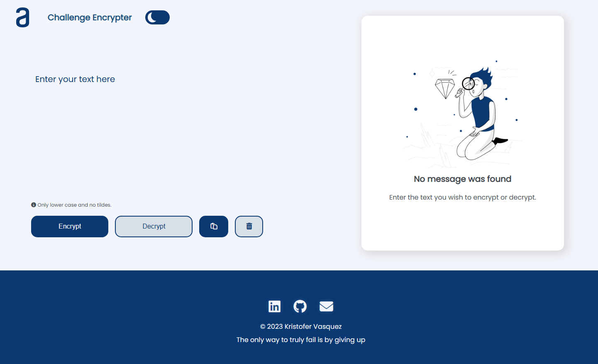
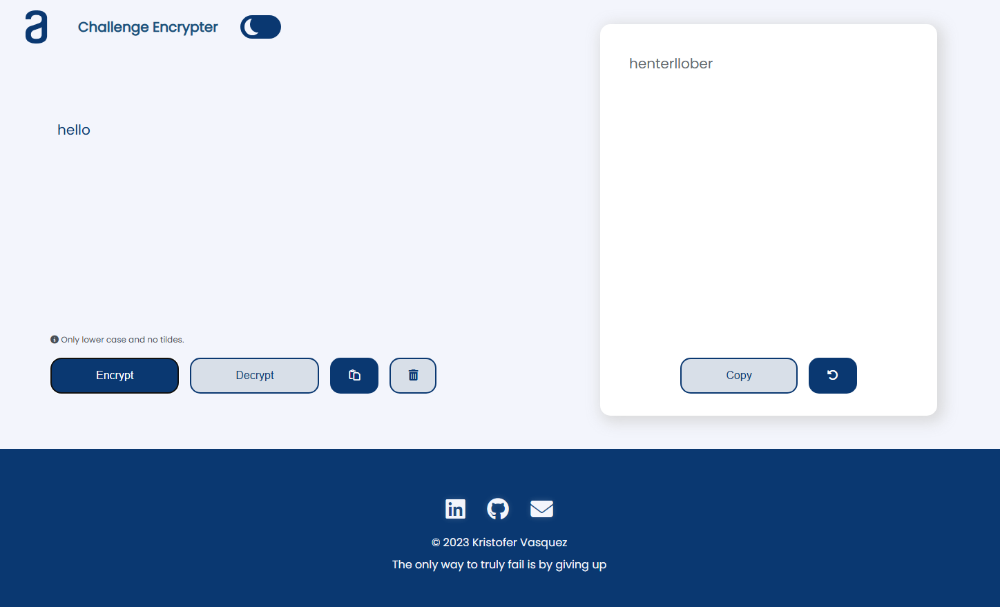
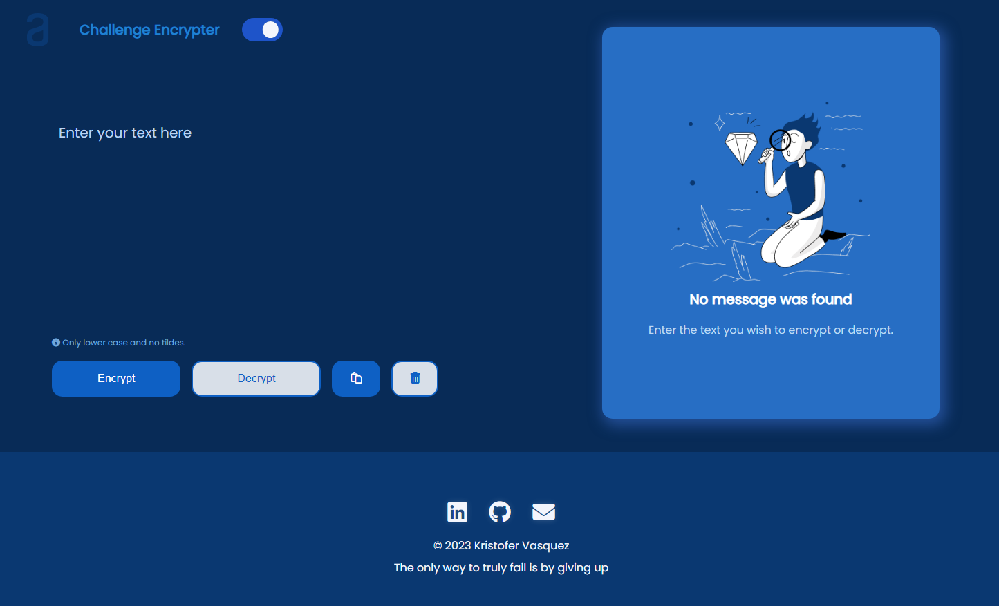

# Challenge Encrypter
Challenge proposed by Alura and Oracle One Next Education program to Encrypt and Decrypt text to an special code wich just modifies vowels. 

Developed only with HTML, CSS and JavaScript. Added special features such as pasting, restarting, deleting text and dark mode theme.

May work on responsive design and option to switch language to Spanish.

* **Updated: 10/19/2025.**

https://kristofer2017.github.io/Challenge-Encrypter/

